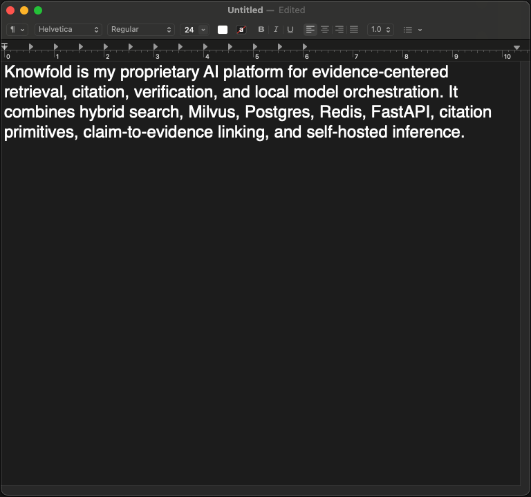

# Mark O'Brien

Principal AI/ML Engineer and hands-on technical leader specializing in production GenAI and traceable systems. Deep experience building end-to-end solutions with LLMs, RAG, computer vision, multi-model routing, evidence attribution, and agentic primitives.

# Recent Work

**Knowfold**:
- Compliance and Security under GenAI and non-deterministic systems
- Evidence grounding with citations and durable auditing
- Cost control with model escalation
- Orchestration aligned with standard agentic workflows: planning / decomposition, reflection / verification, state tracking, and tool execution


Selected AI strategy writing at: https://knowfold.com/blog

## Knowfold

**Knowfold** is an evidence-driven AI platform that helps organizations get trustworthy answers from complex internal and external information. It combines advanced search, structured claims, source-backed evidence, and AI-generated responses so users can see not only the answer, but the material supporting it. This approach bridges the needs of sensitive industries such as finance and healthcare with the latest probabilistic approaches to speech and document processing.

Related theme: <a href="https://knowfold.com/blog/hallucination-reduction-12052025" target="_blank" rel="noopener noreferrer">Hallucination reduction</a>

### Architecture

Hybrid AI platform architecture combining public web surfaces, authenticated API gateways, retrieval infrastructure, multi-step evidence pipelines, and a model ladder that escalates by task. Knowfold routes each request from base-tier workers to frontier APIs only when complexity, cost, or quality thresholds require it:

```text
User / Browser / Product Client
        │
        │ HTTPS / WSS / API
        ▼
Public Web / API Edge
        │
        │ JWT / session validation, origin policy, rate limits, role-based access control
        ▼
Auth + Gateway Layer
        │
        │ private service calls / protected LAN routes
        ▼
    ┌────────────────────────────┐
    │  Orchestration & evidence  │
    │  retrieve · envelope ·     │
    │  policy · audit            │
    └─────────────┬──────────────┘
                  │
      ┌───────────┼───────────┐
      ▼           ▼           ▼
  Generation   Utilities   Knowledge
  & reasoning  (embed,     stores
               rerank)
      │           │
      └─────┬─────┘
            │  capacity control
            ▼
      (optional quality ladder)
            │
            ▼
   Alternate models / repair
   under budget & policy
            │
            ▼
   Response + audit artifacts
```

#### Deployment model

Knowfold is designed around a microservices architecture with heavy GPU usage:

* Heterogeneous model stack with the following roles: instruct, reasoning, ASR, OCR, embedding, reranking, extraction, and semantic document segmentation
* Separate tier for sensitive data, controlled routing
* Cloud models routed in an escalation ladder where cost per performance matters

## Production ASR

Audio pipeline and speech-to-text system...
<details>
<summary>(expand) Professional work includes guiding data scientists...</summary>
... demonstrating browser/iOS audio capture, push-to-talk workflows, WebSocket streaming, and private GPU-backed inference. Additional R&D was completed for speaker diarization, noise cancellation and handsfree intent decomposition and routing, however were not selected for production release.



*Unedited speech-to-text output from the production ASR system.*

This is representative of production speech analytics and voice-enabled workflow capabilities: audio ingestion, streaming transport, model serving, transcript events, auth-gated access, and integration into operational tools.
</details>

**Capabilities**
- Context biasing
- Hotword biasing
- Command customization
- Downstream workflow automation
- Generative output safety

#### Security

Boundaries include:

* Cloudflare proxies
* Public clients authenticate through JWT/session-aware gateway services
* AWS Application Load Balancing
* Browser-facing routes terminate at HTTPS/WSS reverse proxies
* Security group and network Access Control Lists, Linux server hardening
* LAN WebSocket and model services are not publicly routable
* Gateway services broker access to internal workers
* Internal services trust gateway-issued identity
* Redis, Postgres, Milvus, and GPU inference services remain private infrastructure components
* Origin controls, route-level authorization, rate limits, and session scoping are applied before expensive AI work begins

## xLLM Model Aggregator

**xLLM** is a horizontally scalable inference node with cloud frontier model and on-prem hybrid hosting of multiple instruct, reasoning generative models, intent classification, retrieval reranking, claim extraction and structured output formatting. Paid API models have balance verifications with circuit breakers to stay ahead of costly oversights or non-deterministic agentic calls, one of many control layers and guardrails for systems with increased agency.

**Performance Highlights:**
- Production patterns: bounded async queues per modality, saturation signaling, GPU work off the event loop, deploy + prefetch tooling; API versioning; process isolation; per model performance tuning for context sizes, embedding dimensions, long-document use cases

### Product and AI Systems

- RAG-backed user experiences with controlled input behavior, and per-user memory collections.
- Identity and mobile integration through Stytch OAuth/session JWTs, Apple Sign-In, APNS token management, and username/device registration.
- Supporting services include connection pools, model inference queues, Redis-backed context, history/rate limits, Postgres persistence, ASR WebSocket proxying, middleware, origin controls, and admin dashboards.

## Engineering Maturity

- Async-first backend: database access, Redis, HTTP clients, socket handlers, and background workers use asyncio-native service paths.
- Broad test coverage: socket event contracts, auth flows, RAG retrieval, LLM queue behavior, middleware, and API routes.
- Production documentation: iOS socket contracts, auth flows, Nginx/ASR setup, and security audit notes are documented for handoff and operations.
- Admin UI: multiple frontend tabs support human-in-the-loop review, operational workflows, and customer interaction management.


## Execution, Partnership, and Communication

- Prioritize the critical path across product, engineering, GTM, monetization, cost, and delivery.

- Convert market, customer, competitor, and technical signals into stage-appropriate roadmap decisions.

- Own product execution across requirements, timelines, pivots, use cases, customer personas, and implementation tradeoffs.

- Make architecture and budget decisions that balance capability, reliability, speed, and operating cost.

- Lead delivery as product owner, technical lead, and senior hands-on contributor across AI, platform, data, and application systems.

- Coordinate with client teams, stakeholders, and engineers through clear priorities, documented decisions, and proactive communication.

- Increase team leverage through architecture docs, code review, runbooks, reusable patterns, and AI/platform primitives.

- Mentor contributors by clarifying direction, reviewing work, reducing ambiguity, and standardizing repeated decisions.

## Past Machine Learning / Data Science Mentorship
<details>
<summary>(expand) Professional work includes guiding data scientists...</summary>
... in production environments, while consulting for startup CEOs and CTOs in targeted R&D engagements. This included computer vision model performance improvement, pipeline modernization, and upgrading legacy video analysis workflows from frame/time-series heuristics toward deep-learning-native approaches. Related MLOps and model evaluation work was also performed, developing platform architectures and documenting deployments, troubleshooting and training staff on infrastructure.


Past institutional clients include Zalicus, Partners Healthcare, John Hancock Financial, and U.S. Department of Defense.

</details>

# Technical Judgement
<details open>
<summary>Tradeoff decisions faced during execution</summary>

### User Trust and Systems Traceability

**Problem** — Evaluate whether to use high-level LLM/RAG frameworks such as LangChain, LlamaIndex, LlamaParse, and CrewAI, or build lower-level components for retrieval, evidence attribution, citation grounding, and model orchestration.

**Decision** — I used framework components where they helped early prototyping, then rewrote selected parts in custom code where Knowfold needed tighter control over traceability, hybrid on-prem/cloud platform integration, enhanced security, and evidence handling.

The tradeoff was slower initial product velocity. The benefit was better control over grounding, sensitive-domain deployment requirements, and model efficiency. With new controls and customization we were able to shift away from framework dependencies, performance bleed and runaway spend on heavier agent layers.

Furthermore, debugging and evaluation of probabilistic control flows became easier to trace and characterize "why does this end-to-end version seem better or worse, when users are voicing strong opinions and can't cite specifics". This was key enablement for user trust.

</details>
